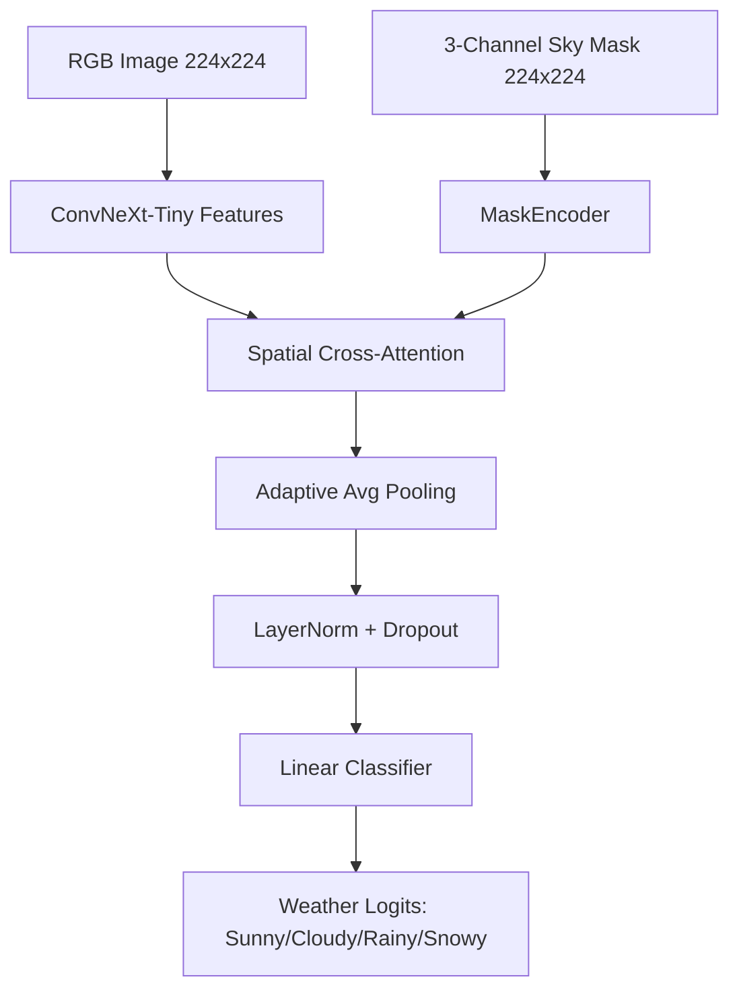

```markdown
# 🌤️ Weather-Classification: ConvNeXt-Tiny + 三通道 Sky Mask 深层空间 Cross-Attention

> 基于现代 Vision Backbone 与语义掩码深度融合的高精度天气分类系统。通过引入三通道天空分割掩码作为空间先验，结合 Spatial Cross-Attention 机制，显著提升了对复杂天气（如雨雾、多云、雪天）的细粒度识别能力。

## ✨ 核心特性

- **🏗️ 双分支深层融合架构**
  - **RGB 分支**: 采用 `ConvNeXt-Tiny` (ImageNet 预训练) 提取全局纹理与颜色特征。
  - **Mask 分支**: 自定义 `MaskEncoder` 将三通道语义掩码编码至与 RGB 相同的深层特征空间 `[B, 768, 7, 7]`。
  - **融合机制**: 实现 `SpatialCrossAttention`，以 RGB 特征为 Query，Mask 特征为 Key/Value，在深层空间进行像素级语义对齐与增强。
- **🎭 三通道语义掩码设计**
  摒弃传统单通道二值掩码，采用三通道解耦设计，提供更丰富的空间先验：
  - `Channel 0`: Clouds + Fog (云/雾区域, 像素值 200)
  - `Channel 1`: Sky-Other (其他天空区域, 像素值 255)
  - `Channel 2`: Ground / Others (地面/背景, 像素值 128)
- **🎯 针对性训练策略**
  - **复合损失函数**: `Focal Loss` (解决类别不平衡) + `Center Loss` (增强类内紧凑度)。
  - **自适应优化**: AdamW + ReduceLROnPlateau + Early Stopping，支持分层学习率与混合精度训练 (AMP)。
  - **鲁棒数据增强**: 针对天气物理特性定制 ColorJitter、GaussNoise、Rotate 等增强管线，严格分离 Train/Val Transform。
- **⚙️ 工程化部署就绪**
  - 完整支持 CUDA / DirectML / CPU 多后端自动适配。
  - 内置训练后自动推理流程 (`run_inference_after_training`)。
  - 结构化日志与指标可视化 (Loss/Acc 曲线自动保存)。

## 📁 项目结构

```text
weather-classification/
├── 3ConvNeXtCrossMask2.py      # 🚀 主训练脚本 (进阶版: Focal+CenterLoss, 分层LR)
├── 3ConvNeXtCrossMask.py       # 基础训练脚本 (单阶段 CE Loss, 用于快速验证)
├── ConvNeXtCrossMask2推理.py    # 独立推理脚本
├── README.md                   # 项目说明文档
├── runs/                       # 训练输出目录 (模型权重、指标曲线)
│   └── convnext_crossmask2/
├── 1cut/                       # 数据集根目录 (按类别子文件夹组织)
│   ├── sunny/
│   ├── cloudy/
│   ├── rainy/
│   └── snowy/
└── sky/                        # 三通道掩码目录 (与图片同名 _mask.jpg)
    ├── sunny-sky-segformer-local/
    ├── cloudy-sky-segformer-local/
    └── ...
```

## 🚀 快速开始

### 1. 环境要求

- Python >= 3.8
- PyTorch >= 2.0 (推荐 2.1+)
- 依赖库: `torchvision`, `albumentations`, `opencv-python`, `numpy`, `matplotlib`, `tqdm`
- 可选加速: `torch-directml` (Windows AMD/Intel GPU), `cudnn` (NVIDIA GPU)

```bash
pip install torch torchvision albumentations opencv-python numpy matplotlib tqdm
```

### 2. 数据准备

确保数据集按以下格式组织：

- **RGB 图片**: `1cut/{class_name}/{image_id}.jpg`
- **掩码文件**: `sky/{class_name}-sky-segformer-local/{image_id}_mask.jpg`
  - 掩码必须为灰度图，像素值严格对应: `200`(云/雾), `255`(天空), `128`(地面)
  - 代码会自动将其转换为三通道 One-Hot 格式

### 3. 训练模型

```bash
# 使用进阶版训练脚本 (推荐)
python 3ConvNeXtCrossMask2.py

# 或使用基础版快速验证
python 3ConvNeXtCrossMask.py
```

训练完成后，最佳模型权重与指标曲线将自动保存至 `runs/convnext_crossmask2/`，并自动触发推理脚本。

### 4. 独立推理

```bash
python ConvNeXtCrossMask2推理.py --weights runs/convnext_crossmask2/ConvNeXtCrossMask2_best_epXXX.pth --image path/to/test.jpg
```

## 📊 模型架构详解



- **Query**: RGB 深层特征 `[B, 768, 7, 7]` → 展平为 `[B, 49, 768]`
- **Key/Value**: Mask 深层特征 `[B, 768, 7, 7]` → 展平为 `[B, 49, 768]`
- **Attention**: Multi-Head Self-Attention (8 heads) + FFN + Residual Connection
- **输出**: 融合后的空间感知特征，保留天气关键区域的响应强度

## ⚠️ 注意事项

1. **掩码质量至关重要**: Cross-Attention 的性能高度依赖掩码的准确性。建议使用 SegFormer 或类似语义分割模型预先生成高质量掩码。
2. **DirectML 兼容性**: 若在 Windows 上使用 AMD/Intel GPU，代码已内置 `torch_directml` 适配，但部分算子可能回退到 CPU，训练速度较慢。
3. **Center Loss 调参**: `ALPHA_CENTER=0.01` 为经验值，若类别极度不平衡可适当增大；若训练不稳定可先设为 0 仅用 Focal Loss。
4. **显存优化**: 默认启用 `channels_last` 内存格式与 AMP 混合精度，若遇到 NaN 可关闭 AMP 调试。

## 📄 License

本项目仅供学习与研究使用。数据集版权归原始作者所有。

